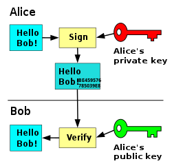

# Firma digital
Dato asociado a un mensaje digital que permite garantizar **autoría** e **integridad** de los documentos digitales.

No implica la **confidencialidad** del mensaje.

## Ley de firma digital

- Se reconoce la eficacia jurídica de la firma electrónica
- **Firma electrónica:** esquema de encriptación asimétrica. No tiene valor probatorio: debe probarse que es válida (se presume que es inválida).
- **Firma digital:** firma electrónica reconocida por la justícia. Tiene valor probatorio: debe probarse que es inválida (se presume válida).

La Jefatura del gabinete de ministros es un ente licenciante, da **licencias** a **certificadores licenciados**, que tiene en un respositorio confiable las claves públicas. Presta servícios de firma digital, es como un *escribano digital*.

Estas **licencias** son:
  - Intransferibles
  - Requieren dictamen legal y técnico

**Obligaciones**
  - Mantener control exclusivo de la clave privada
  - solicitar revocación ante la duda de haber perdido el control
  - Informar cambios en la información del certificado

**Certificado digital**
  - Documento digital firmado digitalmente por un certificador, que vincula los datos de verificación de firma a su titular

**Excepciones**
  - testamentos
  - derecho de família
  - actos personalísimos