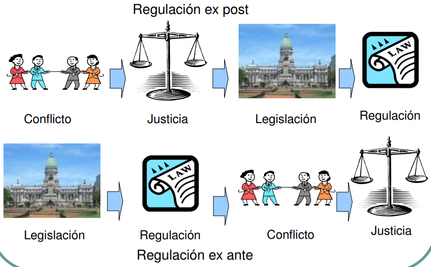

# Telecomunicaciones
UIT: Unión internacional de telecomunicaciones

## Motivos para regular
- Económicos: por la existencia de recursos escasos (espectro, numeración, tendidos, órbitas geoestacionarias)
- Competitivas:
  - Proteger al consumidor, posibilidad de elegir
  - Aseguración del servício
  - Aseguración de la propiedad privada
  - Competencia justa
- Sociales:
  - Servício universal (que las redes lleguen a lugares remotos / gente con menos plata / inclusión / gente con capacidades diferentes)
  - Privacidad
  - Confidencialidad
  - Seguridad

## Tendencias regulatorias

- Ex-post (legislo luego de conflicto o tecnología)
  - Legislo con experiencia, sé qué legislo
  - No hay seguridad jurídica entonces ñas empresass no invierten 
- Ex-ante (legislo antes de conflicto o tecnología)

La legislación puede contradecir / overridear a la jurisprudencia: por eso el tema de la seguridad jurídica.

## Jurisdicción
Las telecomunicaciones son reguladas federalmente.

Los municipios pueden reglamentar cuestiones como por ejemplo dónde pasar cables o no, o dónde poner antenas o no; como una mini pirámide jurídica. (??????????)

## Entes reguladores ve de control
- Regulador: arma normas
- De control: vela por el cumplimiento de las normas

Ventajas:
- Independencia estructural
- Independencia financiera
- Funcionalidad

## Tendencias históricas globales / necesidad de la reglamentación
Etapas:
1. Monopolio público
2. Monopolio privado
3. Competencia parcial
4. Competencia perfecta

(mayor T: más regulación, nunca menos)

Objetivo último de la regulación: acrecentar el acceso a las TIC y proteger al consumidor (la competencia es un medio para esto)

1850: Telegrafía era pública y telefonía privada
1925: telefonía y telegrafía monopolios públicos
Casi 2000: privatización general.

### Historia de las telecos en Argentina

Las redes de telegrafía iban al lado de las ferroviarias pq había infraestructura y pq eran las comunicaciones necesarias para operar el tren. topología red ferroviaria = topografía red de telégrafo. Topo radial alrededor de BA por razones económicas/exportaciones. Hoy en día las comunicaciones se distribuyen a lo largo de una medialuna central que va desde Buenos Aires a Chile, es decir, una línea en vez de un círculo, como es en todo el mundo.

- Primera etapa:
  - 1857: 1er telégrafo
  - 1875: ley 750,5 de telégrafos
  - 1904: se aplica esa ley a la telefonía (con una nueva ley)
  - 1936: ley de QoS: El Estado obliga un QoS mínimo a la empresa (monopolio privado de la telefonía)
- Segunda etapa:
  - 1946: Nacionalización
- Tercera:
  - 1972: Ley nacional de Telecomunicaciones: El contenido es parte de las comunicaciones (Gobierno de facto)
  - 1980: Ley de radiodifusión: el contenido no es parte de telecomunicaciones
- Cuarta: (?)
- Quinta:
  - 2000 reglamentos de:
    - Licencias
    - Interconexión
    - Administración y gestión del espectro
    - Servício universal
  - Ley de medios / telecomunicaciones: renueva leyes viejisimas

## Ley nacional de telecomunicaciones (1972)
Es inescindible. No toca internet.

### Definiciones
- **Telecomunicación:** Toda transmisión, emisión o recepción de signos, señales, escritos, imágenes, sonidos o informaciones de cualquier naturaleza, por hilo, radioelectricidad, medios ópticos u otros sistemas electromagnéticos.
- **Radiocomunicación:** Toda telecomunicación transmitida por medio de las ondas radioeléctricas.
- **Telefonía:** Sistema de telecomunicación para la transmisión de la palabra o, en algunos casos, de otros sonidos.
- **Servicio de Radiodifusión:** Servicio de radiocomunicación cuyas emisiones se destinan a ser recibidas directamente por el público en general. Dicho servicio abarca emisiones sonoras, de televisión o de otro género.
- **Servício telefónico:** Servicio que permite a sus usuarios comunicarse directa o temporalmente entre sí, por medio de aparatos telefónicos y circuitos de la red telefónica pública.

### Otros temas que abarca la ley
- Jurisdicción
- Competencia-Monopolio
- Uso Público
- Seguridad Nacional
- Privacidad
- Autoridad de Aplicación
- Confidencialidad
- Calidad de Servicio
- Licencias
- Interconexión
- Gestión del Espectro
- Guías telefónicas
- Infraestructura (Servidumbre de Teleducto?)
- Observaciones Judiciales (escuchas judiciales)

## Decreto 764/2000
Aprueba los Reglamentos:
- Régimen de Licencias.
- Reglamento Nacional de Interconexión (RNI)
- Reglamento de Gestión y Administración del Espectro Radioeléctrico
- Reglamento del Servicio Universal (SU)

Establece:
- **Autoridad de Aplicación**: Es la SECRETARIA DE COMUNICACIONES del MINISTERIO DE PLANIFICACION FEDERAL, INVERSION PUBLICA Y SERVICIOS. 
  - En algunos casos en forma conjunta con la Secretaría de Defensa de la Compentencia.
- **Autoridad de Control**: Es la COMISION NACIONAL DE COMUNICACIONES, organismo actuante en la órbita de la SECRETARIA DE COMUNICACIONES

### Reglamento general de licencias
- Licencia única y general de telecomunicacones
- Libertad de precios en las regiones donde no hay monopolio (un operador tiene al menos 20% de los ingresos)
- Se pueden revender las licencias
- Los prestadores de radiodifusión podrán prestar licencia de telecomunicaciones

### Reglamento Nacional de Interconexión
- Regula los Convenios de Interconexión entre los distintos prestadores.
- Regula el derecho de solicitar y la obligación de conceder interconexión

#### Definiciones
- **Convenio de interconexión:** acuerdo que celebran los prestadores para que sus clientes tengan acceso a servicios o usuarios del otro.
- **Interconexión:** Conexión entre prestadores
- **Prestador:** Licenciatario de servicios de telecomunicaciones.

#### Lo que establece
- Establece cargos de interconexión en los establecidos por una canasta / precio referencial (no pone un nro)
- Portabilidad numérica como derecho de los usuarios

### Servício Universal

Es un conjunto de programas definidos por el Estado Nacional que establece calidad y precios accesibles para toda la población. Se podrán aplicar a todas las telecos.

Establece un Fondo Fiduciario del Servício Universal.

### Reglamento sobre administración, gestión y control del espectro radioeléctrico

#### Definiciones
- **Atribución de frecuencias**: Determinar para qué uso cada parte de la banda
- **Asignación de frecuencias**: autorización que se otorga a una persona sobre una frecuencia o canal radioeléctrico.
- Comprobación técnica de emisiones: Comprobar que el autorizado cumple requerimientos técnicos y localizar fuentes de interferencias y estaciones radioeléctricas no autorizadas.

#### Lo que establece
- La demanda se satisface por:
  - Concurso o subasta cuando hya más de un interesado o se prevea escasez
  - A pedido
- Las autorizaciones son de caracter nacional excepto para servicios que lo justifiquen
- La autoridad de aplicación puede solicitar el cambio de frecuencias sin indemnización.

#### Servidumbres administrativas de teleductos

Se permite el uso del suelo exento de todo gravamen a fines de la prestación del servício.

Podrán utilizarse los bienes del dominio privado, nacional,
provincial o municipal, sin compensación alguna, para el
tendido o apoyo de instalaciones de los servicios públicos
de telecomunicaciones siempre que se trate de simple
restricción al dominio y no perjudique el uso o destino de
los bienes afectados. 

## Otras cosas:
- Neutralidad de la red: (las redes son best effort) La priorización del tráfico por su contenido va en contra de la neutralidad.